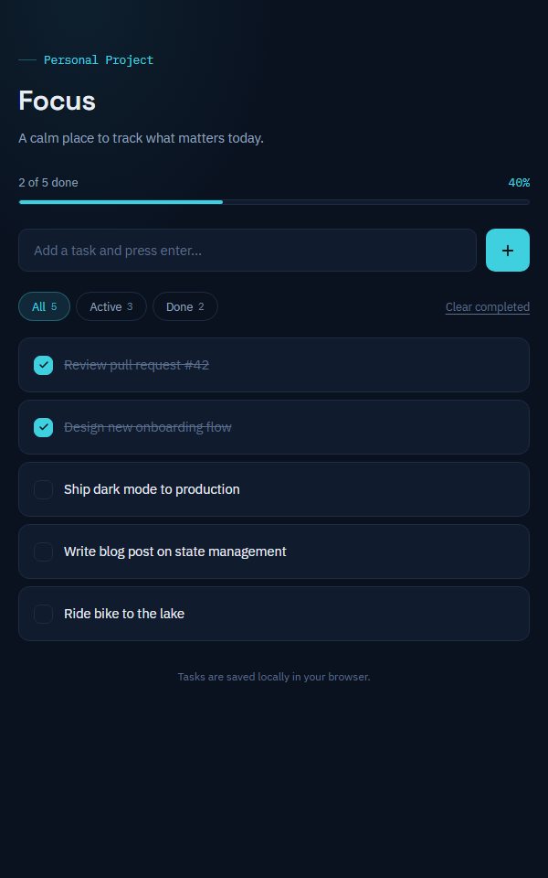

# Focus — To-Do List

A calm, minimal to-do list built with plain HTML, CSS, and vanilla JavaScript. No frameworks, no build step, no dependencies — just open it and start tracking what matters today.

**Live demo:** [add your GitHub Pages link here once deployed]



## Features

- **Add tasks** — type and press Enter (up to 140 characters)
- **Edit inline** — double-click a task or use the pencil icon; Enter saves, Escape cancels
- **Complete tasks** — one click on the checkbox, with a strikethrough + accent highlight
- **Filters** — All / Active / Done, each with a live count badge
- **Clear completed** — bulk-remove finished tasks with a smooth exit animation
- **Progress tracking** — live progress bar and percentage of completed tasks
- **Local persistence** — everything is saved in your browser's `localStorage`, so a refresh (or restart) keeps your tasks
- **Search-free, XSS-safe** — user input is HTML-escaped before rendering
- **Keyboard friendly** — Enter to commit edits, Escape to cancel, no mouse required for core flows
- **Polished UX** — slide-in animations, distinct empty states, hover-revealed actions
- **Accessibility** — respects `prefers-reduced-motion`, uses semantic buttons with `aria-label`s, works in dark mode
- **Responsive** — collapses cleanly on mobile (≤480px)

## Tech

- **HTML** — semantic markup
- **CSS** — dark theme, cyan accent, pure flexbox layout, custom properties
- **JavaScript** — vanilla ES6+ (DOM manipulation, event delegation via direct listeners, `localStorage`)

No dependencies, no build tools, no package manager required.

## Running locally

Clone the repo and open `index.html` in your browser, or serve the folder with any static host:

```bash
# Option A — just open index.html
# Option B — serve locally
npx serve .
```

## Deploying

This is a static site — deploy for free with GitHub Pages:

1. Push this repo to GitHub
2. Go to **Settings → Pages**
3. Set the source to the `main` branch, root folder
4. Your site will be live at `https://<username>.github.io/<repo-name>/`

## Project Structure

```
.
├── index.html   # Markup
├── style.css    # Styling (dark theme, cyan accent, responsive)
├── script.js    # App logic + localStorage persistence
└── README.md    # You are here
```

## How it works

- Todos live in a single array loaded from `localStorage` (key `focus-todo-items`).
- Every mutation (add, toggle, edit, delete, clear) re-renders the list from state and persists immediately.
- Filters are applied at render time; counts and the progress bar are derived from the full list.
- Deletions and "Clear completed" play a short exit animation before the state updates.

## Notes

Built as a portfolio project to demonstrate vanilla JS DOM manipulation, state management without a framework, and UI/UX polish.

---

**License:** This project is unlicensed — all rights reserved by the author. Reach out if you'd like to use it.